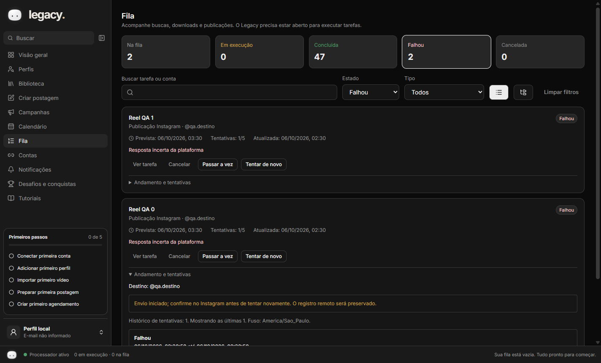
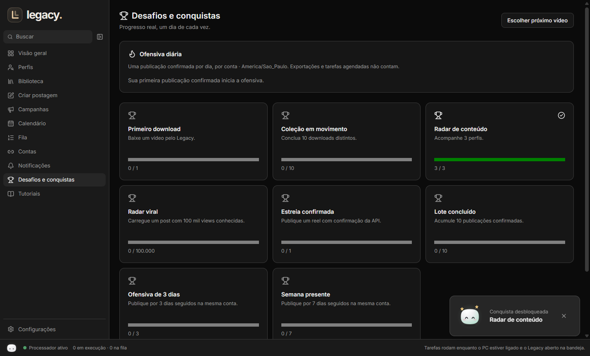
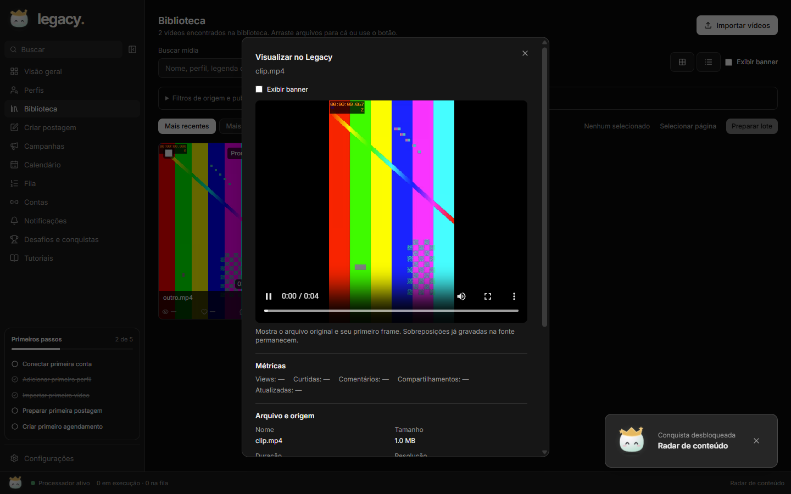

# Legacy

**Seu estúdio de conteúdo, direto no desktop.**


O Legacy reúne pesquisa de perfis, downloads de reels públicos via Apify, biblioteca de vídeos, preparação de lotes, legendas, métricas e uma fila persistente. Um aplicativo Electron com Node.js para organizar a produção de conteúdo com dados armazenados no seu computador.

**Idealização, direção do produto e autoria: [Eduardo Ximenes — @wineerx](https://github.com/wineerx).** Implementação realizada com assistência do Codex.



*Captura real do Legacy 0.7.0 com dados de teste. Valores indisponíveis permanecem como “—”.*

## O que você pode fazer

| Recurso | Uso |
| --- | --- |
| Perfis e downloads | Cole uma URL Instagram, defina um limite e acompanhe os downloads via Apify. |
| Biblioteca | Gerencie grade/lista, filtros, seleção em massa, estados, métricas e detalhes no player interno. |
| Áudio e banner | Registre o áudio real, junte faixas separadas quando fornecidas e alterne banner/original sem modificar o arquivo. |
| Primeiros passos | Checklist compacto na sidebar com marcos reais e persistentes por workspace. |
| Desafios e ofensiva | 8 desafios, celebrações e dias consecutivos por conta, baseados em publicações confirmadas. |
| Histórico e limpeza | Veja contas que já publicaram cada vídeo; limpeza da cópia local é opcional após confirmação. |
| Preparação de lotes | Ajuste legendas, capas e banners antes de exportar. |
| Painel e métricas | Acompanhe tarefas, perfis e métricas conhecidas, com indicação da cobertura. |
| Legendas | Use modelos editáveis ou compare legendas de reels carregados por métricas disponíveis. |
| Armazenamento | Escolha a pasta dos novos vídeos por workspace. |
| Avisos e webhooks | Receba notificações locais e configure entregas HTTPS assinadas, inicialmente desativadas. |
| Tutoriais | Siga tours com foco, destaque, navegação suave e retomada do progresso. |

O Instagram profissional pode ser conectado por token em **Contas** para agendar reels. OAuth pelo navegador, licença e TikTok por API continuam pendentes. A exportação para publicação manual permanece disponível.

## Comece por aqui

1. Abra o Legacy e siga **Visão geral → Tour do Legacy**.
2. Em **Configurações**, escolha onde guardar os novos vídeos.
3. Importe vídeos na **Biblioteca**, ou configure Apify e adicione uma URL em **Perfis**.
4. Selecione um lote e abra **Criar postagem** para ajustar capa, banner e legendas.
5. Escolha Instagram conectado para agendar o original online, ou TikTok manual para preparar a pasta. Acompanhe a **Fila**.
6. Use **Tutoriais** para salvar seu plano de perfil e explorar os modelos de legenda.

[Downloads por perfil](#downloads-por-url-de-perfil-instagram) · [Integrações](#visão-geral-e-integrações) · [Webhooks](#notificações-e-webhooks) · [Tutoriais](#tutoriais-e-legendas) · [Instalação](#instalação-e-atualizações)

## Requisitos

- Windows 10/11 x64
- Node 24
- Build Tools do Visual Studio (C++) apenas se o rebuild do SQLite falhar. Com Electron 42 e better-sqlite3 12.11.1 existe binário pré-compilado, então normalmente não é preciso.

## Comandos

```
npm i                 # instala e recompila better-sqlite3 para o Electron
npm run fetch:ffmpeg  # baixa o FFmpeg LGPL fixado e confere o sha256
npm run dev           # abre o app em modo desenvolvimento
npm test              # Vitest sob Electron (ELECTRON_RUN_AS_NODE)
npm run typecheck     # tsc dos projetos node e web
npm run e2e           # build + Playwright (Electron)
npm run dist          # instalador NSIS em dist/ (sem assinatura se CSC_LINK não estiver definido)
```

## Pasta de dados

- Padrão: `%APPDATA%/Legacy`. Alternativa: variável `LEGACY_DATA_DIR`.
- Em **Configurações → Armazenamento dos vídeos**, use **Alterar pasta dos vídeos** ou **Restaurar pasta padrão**. A escolha é persistida por workspace; o destino personalizado usa `<pasta escolhida>/Legacy/<workspace>/media`.
- A troca vale para novas importações/downloads. Arquivos existentes permanecem no local original, incluindo miniaturas e versões editadas, e continuam acessíveis. Não há migração automática. Mantenha unidades externas conectadas.
- Banco, capas de modelo, temporários e exportações permanecem na pasta de dados.
- Backup: feche o app e copie a pasta de dados **e todas as pastas personalizadas usadas**. Restaurar: recoloque nos mesmos caminhos, com o app fechado.

## Downloads por URL de perfil (Instagram)

1. Na **Visão geral → Configurar Apify**, cadastre sua chave e clique em **Testar chave salva**. O teste consulta a conta sem iniciar um Actor pago. A chave é protegida pelo Windows e aplicada ao worker sem reiniciar. Alternativa: variável de ambiente `APIFY_TOKEN`; `.env.example` é referência e não é carregado automaticamente. Nunca use `VITE_APIFY_TOKEN`.
2. Abra **Perfis**, cole `https://www.instagram.com/usuario/` e clique em **Adicionar perfil**.
3. Com Apify configurada, adicionar o perfil inicia a descoberta da grade. Defina de 1 a 1.000 posts; o limite não garante todo o histórico. Filtre vídeos/imagens, curtidas e comentários, ordene pela métrica desejada e selecione os melhores X.
4. Use **Baixar selecionados** para guardar os arquivos, **Preparar lote** para editar vídeos já baixados ou **Programar selecionados** para escolher uma conta conectada, horário e intervalo. O app leva você à Fila. A operação de descoberta usa o serviço pago Apify conforme o saldo/plano da sua conta.
4. Acompanhe a busca e cada download na **Fila**. Os arquivos validados aparecem na **Biblioteca**; os posts preservam legenda, link original e métricas disponíveis.

Implementação: Node.js no worker do Electron, API REST dos Actors `apify/instagram-scraper` (grade) e `apify/instagram-reel-scraper` (download direto). Chaves cadastradas são criptografadas com safeStorage/DPAPI no banco; a interface recebe somente estado e data de validação, sem ler a chave de volta. O worker recebe as credenciais em memória pelo processo principal. Não exige senha do Instagram. A busca de reels públicos depende da disponibilidade do provedor; não cobre TikTok, perfis privados nem garante todos os vídeos de um perfil. Filtros e seleção trabalham sobre os posts já carregados. Métricas ausentes ficam indisponíveis; `videoViewCount` não é substituído por reproduções.

Ao clicar no card em Perfis ou Biblioteca, o player abre dentro do Legacy. Ele prefere o arquivo baixado e, quando disponível, usa a URL online do CDN do Instagram. Se a URL expirar ou o formato não for suportado, aparece uma mensagem para buscar/baixar novamente. O Instagram abre somente no botão **Ver origem no Instagram**.

## Visão geral e integrações

A Visão geral reúne indicadores clicáveis de tarefas, fila, falhas, perfis, vídeos guardados e notificações, atualizados a cada cinco segundos. A tabela de perfis mostra somas das métricas conhecidas e a cobertura (quantos posts têm o valor disponível). Um conjunto sem dados exibe `—`, preservando zeros reais. Os números são dos posts carregados no workspace, não o total do perfil na rede social.

**APIs, notificações e webhooks** também está em Configurações. Apify tem cadastro, remoção e teste da chave. Instagram pode ser conectado em Contas; TikTok por API mostra as dependências pendentes. Guardar uma chave Apify não conecta uma conta para publicação.

## Notificações e webhooks

Alertas configuráveis: conclusões de tarefas, falhas e avisos do Windows. Miniaturas concluídas não geram avisos. A central interna possui leitura individual e em lote; alertas nativos dependem das permissões e do modo Não perturbe. Avisos pendentes são agrupados por workspace, com verificação a cada 30 segundos. O botão **Criar notificação de teste** permite conferir o comportamento.

Webhooks são **de saída**, desativados por padrão conforme solicitado. Para ativar, informe um domínio HTTPS público na porta padrão, sem query/credenciais, um segredo de pelo menos 32 caracteres e os eventos `job.done`/`job.failed`. Salve antes de enviar um teste. O histórico mostra as últimas 20 entregas. Não há listener público nem recebimento de webhooks Meta/TikTok nesta versão.

Cada evento contém ID, tipo, data UTC, workspace e ID/tipo/estado/tentativa da tarefa. Não inclui token, vídeo, legenda, URL de mídia ou caminho local. O receptor verifica os cabeçalhos `X-Legacy-Event-Id`, `X-Legacy-Timestamp` e `X-Legacy-Signature`:

```text
X-Legacy-Signature = sha256=<HMAC-SHA256(segredo, timestamp + "." + corpo JSON bruto)>
```

Compare assinaturas em tempo constante, valide a idade do timestamp e deduplique pelo ID do evento. As entregas têm até cinco tentativas com backoff, respeitam Retry-After para HTTP 429/5xx, recusam redirects e redes privadas, e expiram após 15 segundos por requisição. Troca de destino, segredo ou ativação invalida envios antigos. Uma requisição já enviada não pode ser retirada; não se promete exactly-once. Falha em webhook não gera outro webhook recursivamente.

## Tutoriais e legendas

**Visão geral → Tour do Legacy** ou **Tutoriais → Iniciar tour do Legacy** abre um tour de 12 passos com foco no popup, destaque do controle, navegação suave, retorno/avanço e pausa com Escape. O progresso é salvo por workspace no navegador local. Em Tutoriais, retome ou reinicie. A preferência de movimento reduzido do Windows/navegador é respeitada.

O **guia de perfil** tem oito passos, um plano editável (tema, público, bio e cadência) salvo no workspace e as seis referências indicadas. Adicionar uma referência cadastra apenas o link. A criação da conta acontece no Instagram oficial; o Legacy organiza pesquisa, biblioteca, edição, exportação, lembretes e análise. O guia não garante crescimento ou alto engajamento.

**Legendas do Legacy** aparece no editor, nos perfis e nos tutoriais como uma faixa horizontal. Modelos prontos são sugestões editáveis, sem validação de resultado; substitua os campos entre colchetes. No editor, **Usar modelo** preenche a legenda base. **Reels em destaque** lista até 20 legendas dos posts realmente carregados, ordenadas por visualizações, curtidas ou comentários, preservando fonte e link original. Posts sem legenda ou sem a métrica escolhida não entram no ranking.

Não foi possível ler os perfis de referência diretamente pelo Instagram durante a implementação; não foram inventadas legendas, números ou rankings. A lista de conteúdos reais será preenchida pela Apify configurada ou por CSV/JSON importado. A posição no ranking do reel não prova que sua legenda causou o engajamento.

## Instalação e atualizações

Versão: **0.7.0**. O instalador NSIS é gerado por `npm run dist`. Em **Visão geral** ou **Configurações → Atualizações**, use **Verificar atualizações**, **Baixar atualização** e **Instalar e reiniciar**. A instalação espera não haver tarefas em execução. Nenhum download ou reinício acontece sem clicar nos botões.

A versão 0.2 precisa ser atualizada uma vez pelo instalador para receber esses controles. Depois disso, o atualizador consulta Releases públicas de `wineerx/Legacy`, que precisam conter o instalador, `.blockmap` e `latest.yml`. Sem uma Release válida, a interface informa a falha; não afirma que está atualizada. Em desenvolvimento, o atualizador fica indisponível. Dados permanecem fora da pasta do aplicativo; credenciais criptografadas podem exigir novo cadastro ao trocar usuário ou computador Windows.

### Conectar e programar Instagram

Em **Contas**, informe um token de uma conta profissional obtido no seu app Meta com permissões de identificação e publicação de conteúdo. O Legacy valida a identidade e protege o token com DPAPI. Esta versão conecta uma conta por workspace; não realiza OAuth pelo navegador nem renova o token automaticamente. A validação de identidade não confirma a permissão de publicar.

Em **Perfis**, baixe os vídeos selecionados antes de **Programar selecionados**. Na **Biblioteca**, vídeos importados do computador também podem ser publicados, sem URL ou post de origem. O Instagram recebe uma cópia MP4 local por HTTPS temporário, incluindo a versão editada escolhida. Data e horário seguem o fuso do workspace. Trocar ou desconectar a conta invalida o destino dos agendamentos anteriores; revise a conta antes de recriar tarefas.

A fila persiste após reinício, salva o ID da execução remota e deduplica arquivos por SHA-256 no workspace. Cada arquivo tem até três tentativas, limite de 1 GiB e timeout de cinco minutos. Links expirados exigem nova busca. Tarefas ainda na fila podem ser canceladas; uma execução já iniciada termina ou expira. Se a resposta de criação da execução Apify se perder, confira o console Apify antes de iniciar outra busca: o app não repete uma cobrança potencialmente aceita.

O fluxo foi implementado para a [API Apify](https://docs.apify.com/api/v2) e o [contrato do Actor](https://apify.com/apify/instagram-reel-scraper/input-schema), consultados em 2026-10-05. Integração externa não validada com credencial real nesta entrega.

## Limitações

- O agendamento e os lembretes só rodam com o PC ligado e o app aberto (ele continua na bandeja ao fechar a janela).
- TikTok é manual: o app prepara a pasta (vídeo, capa, legenda) e cria um lembrete.
- Instagram exige uma conta profissional e token com permissões corretas. A integração real de publicação ainda precisa ser validada com suas credenciais; os testes usam respostas simuladas.
- O instalador sai sem assinatura de código; o SmartScreen avisa na instalação.

## Documentação

- [Arquitetura e processos](docs/architecture.md)
- [Design system](docs/design-system.md)
- [Segurança, dados e credenciais](docs/security.md)
- [Capacidades e limitações das plataformas](docs/platform-capabilities.md)
- [Decisões técnicas](docs/decisions/)
- [Roadmap](docs/roadmap.md)

## Qualidade e desenvolvimento

Stack: Electron 42.11.10, Node.js 24, React 19, TypeScript, SQLite/Drizzle, TanStack Query e FFmpeg LGPL. Renderer isolado e sem acesso direto ao Node; operações passam por contratos IPC validados, processo principal e worker.

Verificação da versão 0.7.0: **345 testes unitários e de integração**, **20 testes E2E no Electron** e typecheck concluídos. Testes de Apify, Instagram, atualizações e webhook usam respostas simuladas; integração externa com credencial real permanece pendente.

Para contribuir, descreva o problema, mantenha o isolamento por workspace e execute `npm run typecheck`, `npm test -- --maxWorkers=2` e os E2E pertinentes. Não inclua tokens, bancos locais, vídeos pessoais ou pastas de dados no Git.

## Créditos

**Eduardo Ximenes (@wineerx)** é o idealizador e autor do projeto Legacy, responsável pela visão do produto, requisitos e direção das funcionalidades. Desenvolvimento com assistência do Codex. As bibliotecas e ferramentas utilizadas mantêm suas próprias autorias e licenças; consulte suas distribuições para os termos correspondentes.

As referências Instagram no guia foram indicadas para estudo. Elas não representam parceria, endosso ou autoria do Legacy, e suas legendas não foram reproduzidas nesta documentação.

## Versionamento no GitHub

Trabalhe em branches `codex/…` e abra PRs para `main`. Cada commit recebe uma execução de CI e um instalador identificado pelo SHA. Atualize a versão do pacote, lockfile, preload e CHANGELOG quando preparar uma versão. A workflow de release publica pelo GitHub ao receber uma tag `vX.Y.Z` igual à versão do pacote. Execute a release somente após revisar o PR e validar o CI; não inclua dados locais ou segredos.

## Design, conquistas e histórico (0.4)



Veja o [plano de Design System](docs/design-system-0.4.md). Perfis separa filtros avançados e ações da seleção; ícones têm nomes acessíveis e ajuda contextual. Notificações recolhem eventos do mesmo lote, com filtros de categoria, não lidas e falhas. Animações respeitam movimento reduzido.

Em **Desafios e conquistas**, a ofensiva conta dias locais com publicação confirmada na mesma conta; agendamentos, exportações e downloads não contam como publicação. O histórico conserva conta, hash disponível, perfil de origem, legenda e métricas capturadas.

Em **Programar selecionados**, marque **Apagar a cópia do Legacy após publicação confirmada** somente se quiser liberar espaço. Desligado por padrão. A cópia é mantida se outra tarefa ainda a usa; falhas de limpeza não reenviam a postagem. Arquivos originais importados são preservados.

A conexão Instagram utiliza **user_id**, o identificador profissional documentado pela Meta, e permite **Verificar conexão** sem reexpor o token. Reconectar a mesma conta preserva os agendamentos; trocar o destino invalida os anteriores. Não existe OAuth embutido nesta versão: gere o token Instagram User no painel Meta, aceite o convite de testador quando necessário e conecte em Contas. A identidade validada não garante permissão de publicação.

## Gerenciador de mídia 0.5

[Guia de uso, diagnóstico, limites e recuperação](docs/media-manager-0.5.md). O menu da mídia permite visualizar, criar postagem, agendar conteúdo com origem online e salvar cópias. A exclusão bloqueia arquivos em uso e preserva originais externos e publicações confirmadas. Dados de teste nas capturas não representam publicações reais.



## Publicação e componentes 0.6

Consulte [o guia de publicação e UI](docs/publishing-ui-0.6.md) para destinos, conexão por token, calendário, sidebar e limites da integração. TikTok permanece exportação manual.

## Fila e recuperação — 0.7.0

A fila tem contagens completas, busca por tarefa/conta, filtros por estado e tipo, paginação e árvore dos lotes reais. Cada tarefa revela seu andamento e as últimas 50 tentativas com duração e erro. O player e a origem permanecem acessíveis em **Ver tarefa**.

Uma publicação falhada pode ser **cancelada**, **realocada com Passar a vez** ou repetida. Passar a vez sugere 15 minutos após o último agendamento pendente do mesmo tipo e conta; você revisa o horário no calendário antes de confirmar. Histórico e checkpoints remotos permanecem, e os demais horários não mudam. Tarefas em execução não podem ser canceladas ou realocadas.

Consulte o [guia da fila](docs/queue-operations.md) e a [análise de login Instagram pelo navegador](docs/instagram-login.md). OAuth é viável para contas profissionais, mas depende de um servidor HTTPS e configuração Meta. A versão 0.7.0 ainda usa token protegido pelo Windows; nenhum segredo de app foi colocado no instalador.

## Compilação consolidada para revisão

A 0.7.2 reúne os PRs #8/#9 e o suporte local que ficou no worktree de publicação. A versão pública do GitHub é independente desta compilação local. Confira versão e commit completo em **Configurações → Sobre esta versão**, no título da janela e em `out/main/build-info.json`.

Compile após o commit final com `npm run build` e empacote com `npx electron-builder --win --publish never`. A compilação captura o SHA do checkout; não precisa de Git instalado no computador de destino. O instalador atualiza os executáveis e mantém a pasta de dados. Faça backup consistente do SQLite antes da atualização. A migração 0004 preserva histórico, credenciais e fila, permitindo publicações sem post remoto. Cada abertura inicia na entrada visitante e aguarda sua entrada para executar novas tarefas.
